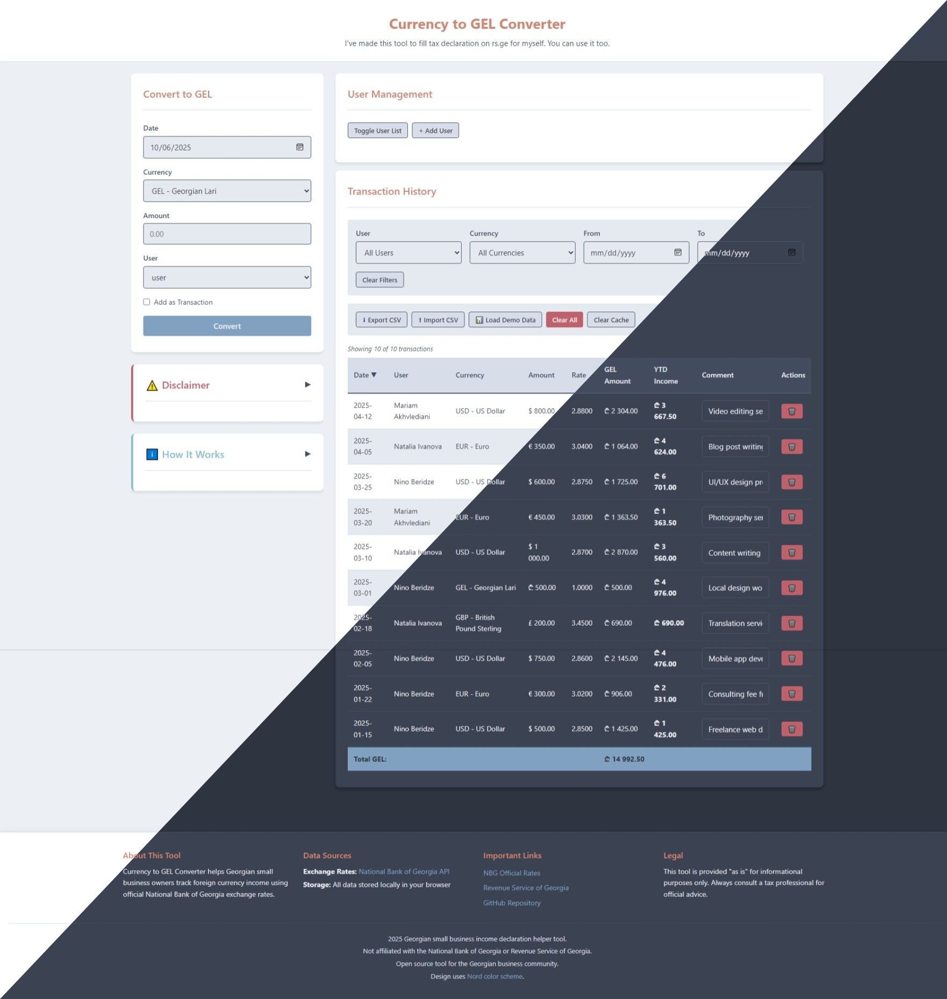

# Currency to GEL Converter 

A static web application for Georgian small business owners to track foreign currency income and convert it to Georgian Lari (GEL) using official National Bank of Georgia exchange rates for tax declaration purposes.




## Features

- **Official Exchange Rates**: Uses National Bank of Georgia's official daily rates via their public API
- **Historical Data**: Access exchange rates for any past date
- **Multi-User Support**: Track transactions for multiple individuals or business entities with taxpayer ID management
- **Year-to-Date Calculation**: Automatically calculates running totals per user per calendar year
- **Transaction Management**: Add, edit, filter, and sort currency conversion transactions
- **Data Export/Import**: Export to CSV for backup or import into spreadsheet applications
- **Demo Data**: Load sample transactions to explore features before entering real data
- **Offline Storage**: All data stored locally in your browser - works offline after initial load
- **Responsive Design**: Works on desktop and mobile devices

## Quick Start

### Run Locally

Simply open `index.html` in your web browser

### How to Use

#### Getting Started

**Option 1: Load Demo Data**
- Click "📊 Load Demo Data" to explore the app with sample transactions
- Demo data includes 3 users and 10 sample transactions
- Note: Demo data can only be loaded if you have no existing transactions

**Option 2: Start Fresh**
1. The app creates a default "user" on first launch
2. Customize this user or create new ones via "User Management"

#### Managing Users

1. Click "User Management" → "Toggle User List" to view all users
2. **Add User**: Click "+ Add User" to create new user profiles
3. **Edit User**: Change name or taxpayer ID, then click "💾 Save"
4. **Delete User**: Click "🗑️" to remove a user (also deletes all their transactions)
   - **Note**: The default 'user' account cannot be deleted individually - create other users first
5. **Delete All**: Use "🗑️ Delete All Users" to reset and start fresh

#### Recording Transactions

1. **Convert Currency**:
   - Select the transaction date (uses official NBG rate for that date)
   - Choose the currency (GEL for local transactions, or foreign currency)
   - Enter the amount received
   - Select the user
   - Check "Add as Transaction" to save it to the history
2. **Review Transactions**: View all transactions with automatic YTD income calculation
3. **Filter & Sort**: Use filters to narrow down by user, currency, or date range; click column headers to sort
4. **Add Comments**: Click in the comment field to add notes to any transaction
5. **Export for Tax Filing**: Use "⬇ Export CSV" to download data for your accountant or tax records

## Development

### Prerequisites

- Docker and Docker Compose (for containerized deployment)
- Node.js and npm (for linting)
- Python 3 with pre-commit (for code quality checks)

### Code Quality

```bash
# Run pre-commit hooks
pre-commit run --all-files

# Run ESLint
npx eslint *.js

# Check JavaScript syntax
node --check script.js
```

### Deployment

- **GitHub Pages**: Automatically deploys on push to `main` branch
- **Self-hosted**: Configure via `.env` file for Traefik reverse proxy:
  ```bash
  SERVICE_NAME_OVERRIDE=your-subdomain
  DOMAIN_NAME=example.com
  TRAEFIK_CERT_RESOLVER=letsencrypt-cloudflare-dns-challenge
  ```

## Data Management

### Storage & Privacy

All data is stored exclusively in your browser's local storage. No information is transmitted to any server except for fetching exchange rates from the National Bank of Georgia's public API. Clearing your browser data will delete all transactions.

### Import/Export

- **Export CSV**: Download all transactions (or filtered subset) as CSV file
- **Import CSV**: Upload previously exported CSV files to restore data
  - Automatically creates missing users
  - Skips duplicate transactions based on timestamp
  - Prevents creating duplicate users during import
- **Demo Data**: Load sample data to test the application (`demo-data.csv`)
  - Only works when no transactions exist
  - Includes 3 sample users with 10 transactions

### Deleting Data

- **Delete Transaction**: Individual transactions can be removed from the transaction list
- **Delete User**: Removes user AND all associated transactions (requires confirmation)
  - Protected: The default 'user' account cannot be deleted if it's the only user
- **Delete All Users**: Removes all users and transactions, creates fresh default user
- **Clear All Transactions**: Removes all transactions but keeps users
- **Clear Cache**: Clears cached exchange rates (forces fresh API calls)

## API Reference

- **National Bank of Georgia**: [Official Currency Rates](https://nbg.gov.ge/en/monetary-policy/currency)
- **JSON API Endpoint**: `https://nbg.gov.ge/gw/api/ct/monetarypolicy/currencies/en/json/?date=YYYY-MM-DD`

## Disclaimer

⚠️ **This tool is provided for informational purposes only and should not be considered as professional tax or financial advice.**

- This application is provided "as is" without any warranties, express or implied
- The accuracy of currency conversions and calculations is not guaranteed
- This tool does not constitute tax, legal, or financial advice
- Always consult with a qualified tax professional or accountant for your specific situation
- You are solely responsible for verifying all data and calculations before using them for official tax declarations

## Contributing

Contributions are welcome! Please feel free to submit a Pull Request.

## License

GPLv3. See [Licence file](./LICENSE) for more information

## Links

- [National Bank of Georgia](https://nbg.gov.ge/en/monetary-policy/currency)
- [Revenue Service of Georgia](https://rs.ge)
- [GitHub Repository](https://github.com/5mdt/georgian-small-business-income-declaration)

---

Not affiliated with the National Bank of Georgia or Revenue Service of Georgia.
