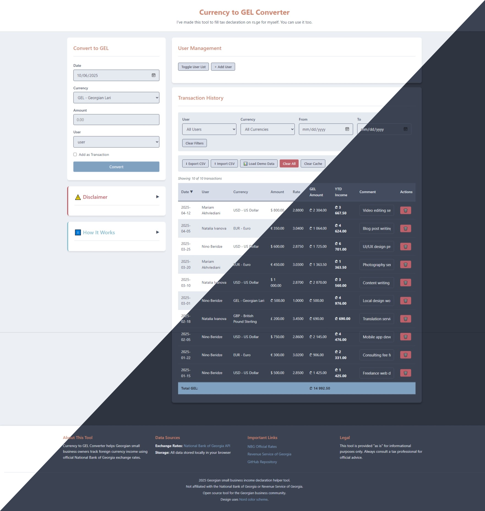

# Currency to GEL Converter 

A static web application for Georgian small business owners to track foreign currency income and convert it to Georgian Lari (GEL) using official National Bank of Georgia exchange rates for tax declaration purposes.

## Features

- **Official Exchange Rates**: Uses National Bank of Georgia's official daily rates via their public API
- **Historical Data**: Access exchange rates for any past date
- **Multi-User Support**: Track transactions for multiple individuals or business entities with taxpayer ID management
- **Year-to-Date Calculation**: Automatically calculates running totals per user per calendar year
- **Transaction Management**: Add, edit, filter, and sort currency conversion transactions
- **Data Export/Import**: Export to CSV for backup or import into spreadsheet applications
- **Demo Data**: Load sample transactions to explore features before entering real data
- **Offline Storage**: All data stored locally in your browser - works offline after initial load
- **Responsive Design**: Works on desktop and mobile devices

## Quick Start

### Run Locally

Simply open `index.html` in your web browser

### How to Use

Check "[Getting Started](./docs/GETTING-STARTED.md)" page for user guide.

See the [Feature Requirements Document](./docs/FRD.md) for how each feature
works, including step-by-step usage notes in each feature's Human Testing
section.

## Development

See [Contributing](./docs/CONTRIBUTING.md) for prerequisites, code rules,
and deployment.

This project follows [Docs-Driven Development](./docs/DDD.md).

## Disclaimer

⚠️ **This tool is provided for informational purposes only and should not be considered as professional tax or financial advice.**

- This application is provided "as is" without any warranties, express or implied
- The accuracy of currency conversions and calculations is not guaranteed
- This tool does not constitute tax, legal, or financial advice
- Always consult with a qualified tax professional or accountant for your specific situation
- You are solely responsible for verifying all data and calculations before using them for official tax declarations

## License

GPLv3. See [Licence file](./LICENSE) for more information

## Links

- [National Bank of Georgia](https://nbg.gov.ge/en/monetary-policy/currency)
- [Revenue Service of Georgia](https://rs.ge)
- [GitHub Repository](https://github.com/5mdt/georgian-small-business-income-declaration)

---

Not affiliated with the National Bank of Georgia or Revenue Service of Georgia.
