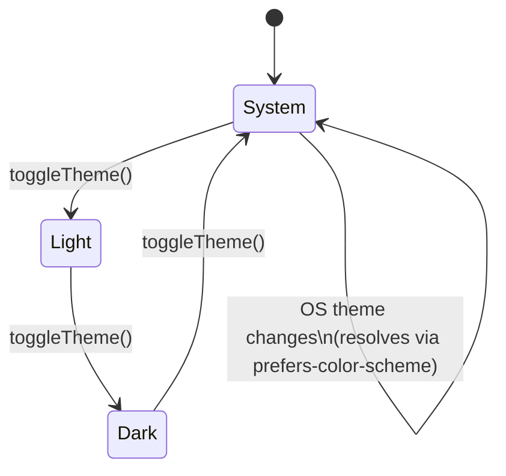

# T4G-0015. Theme switcher

**Tags:** #theme #ui

## User Story

As a small business owner, I want to choose Light, Dark, or System appearance, so
that the app matches my preference or my OS setting.

## Behavior

Lets a user cycle between System, Light, and Dark appearance, in addition
to the automatic `prefers-color-scheme` dark mode.

## Implementation

`script.js` (Theme Management section):
- `THEME_OPTIONS = ['system', 'light', 'dark']`, cycled by `toggleTheme()`:

- `getThemePreference()` reads `t4g_config_themePreference`
  (`STORAGE_KEYS.themePreference`, `src/keys.js`;
  [T4G-0013](T4G-0013-local-storage-persistence.md)), defaulting to
  `'system'`.
- `getCurrentEffectiveTheme()` resolves `'system'` to `'dark'`/`'light'` via
  `window.matchMedia('(prefers-color-scheme: dark)')`.
- `applyTheme(theme)` sets/removes `data-theme` on `<html>`, updates the
  toggle button's icon/label/aria-label, and persists the choice.
- `initTheme()` runs at module load (before DOM content loads, to prevent a
  flash of the wrong theme) and registers a `matchMedia` change listener
  (`setupSystemThemeListener`) that refreshes the aria-label when the OS
  theme changes while the preference is `'system'`.

`style.css` — Nord-themed; dark mode via
`@media (prefers-color-scheme: dark)` plus `[data-theme="dark"]`/
`[data-theme="light"]` overrides. `.disclaimer-card` and `.info-card` must
keep using `var(--bg-card)` for dark mode to render correctly.

## Testing

### Human

- Click the theme toggle button — cycles System → Light → Dark → System,
  updating the icon, label, and page appearance each time.
- With preference set to System, change the OS theme — the app follows it
  and the button's aria-label updates.

### Integration

`tests/integration/app.test.js` (`theme toggle`): cycles
system → light → dark → system and updates the DOM.

## Status

Implemented
