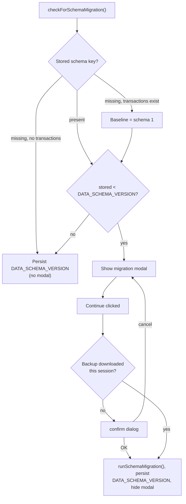

# T4G-0019. Data schema version

**Tags:** #storage #migration #ui #csv

## User Story

As a returning user, I want to be prompted to back up before my stored data is
migrated to a new shape, so that I don't lose data if a migration goes wrong.

## Behavior

Tracks the shape/version of the data stored in `localStorage`, separately
from the app version ([T4G-0018](T4G-0018-update-notification.md)). When the
running code's data schema is newer than the user's stored data, shows a
modal recommending a backup before the data is treated as migrated.

## Implementation

`src/version.js`: `DATA_SCHEMA_VERSION` — a monotonic integer (`1, 2, 3…`),
not semver. A data shape has no meaningful "major/minor/patch" split, so
this follows the conventional DB-migration numbering instead (Rails/Django
style). Bumped by hand whenever a stored data shape actually changes,
alongside a matching entry in `src/migrations.js`'s `MIGRATIONS` registry
and transform function — see
[T4G-0021](T4G-0021-schema-migration-key-namespacing.md), the schema `1` →
`2` key-namespacing migration that's the first to use this runner.

`script.js` (Data Schema Migration section):
- `DATA_SCHEMA_STORAGE_KEY = 't4g_dataSchemaVersion'`.
- The modal (`#migrationModal` in `index.html`, same `.modal-overlay`/
  `.modal` styling as [T4G-0018](T4G-0018-update-notification.md)'s update
  modal) has two controls: "Download backup" → `openExportModal()`, the
  shared Export modal from [T4G-0020](T4G-0020-backup-and-restore.md)
  (transactions CSV / users CSV / full JSON backup); "Continue" →
  `dismissMigrationModal()`, which runs the actual migration
  (`runSchemaMigration()`) before stamping the new version. No backdrop/
  Escape dismissal.

Only a successful full JSON backup export (not the transactions-CSV or
users-CSV options) sets in-memory `migrationBackupDownloaded = true` — the
other two formats aren't guaranteed to be a *complete* backup (a filtered
transactions CSV, or a users CSV with no transactions), so they don't
satisfy the "backup downloaded" check in the flow above.

**Load ordering with T4G-0018**: `checkForSchemaMigration()` only runs
after the update modal is resolved — chained from `checkForAppUpdate()`
(when no update is pending) and from `dismissUpdateModal()` (once the
update modal closes) — so the two modals never stack.

**Self-description, and schema-of-*data*, not schema-of-*code***: every
export (CSV or JSON, [T4G-0020](T4G-0020-backup-and-restore.md)) is tagged
with the schema version of the data actually being exported — read from
`t4g_dataSchemaVersion` (falling back to the same
`1`-if-transactions-exist baseline as `checkForSchemaMigration` above), not
the running code's `DATA_SCHEMA_VERSION`. A backup taken while a migration
is still pending is therefore correctly labeled with the shape it actually
has, not the shape the code would produce after migrating — so it can never
be mistaken for already-migrated data on restore. CSV exports also append
trailing `#`-prefixed comment lines (file description, GitHub URL, instance
URL if known, data schema version); none has 12+ comma-separated values, so
`validateCSVRow` silently drops them on re-import with no parser changes
needed.

## Testing

### Human

- Fresh install (clear site data) — no modal; `t4g_dataSchemaVersion` is
  set to the current schema version.
- In devtools, set `localStorage['t4g_dataSchemaVersion']` to `0` and
  ensure at least one transaction exists, then reload — migration modal
  appears (after any pending update modal).
- Click "Continue" without exporting — a confirm dialog warns no backup was
  downloaded; canceling keeps the modal open.
- Click "Download backup", pick "Full backup (JSON)", then "Continue" — no
  confirm prompt; modal closes immediately. Picking one of the other two
  export options first still prompts the confirm, since neither is
  guaranteed to be a complete backup.
- Reload again — modal does not reappear.
- Import that backup file back in — it's accepted normally.

### Integration

`tests/integration/app.test.js` (`data schema migration`): key missing + no
legacy data (silent fresh-install baseline); key missing + legacy transactions
present (baseline resolves to schema 1, modal shows since the code is schema
2 — see [T4G-0021](T4G-0021-schema-migration-key-namespacing.md)); stored
version below current (modal shows); Continue without backup
(confirm-gated); Download backup opens the Export modal and a successful
export from it skips the confirm; modal ordering relative to the
update-notification modal.

## Status

Implemented
