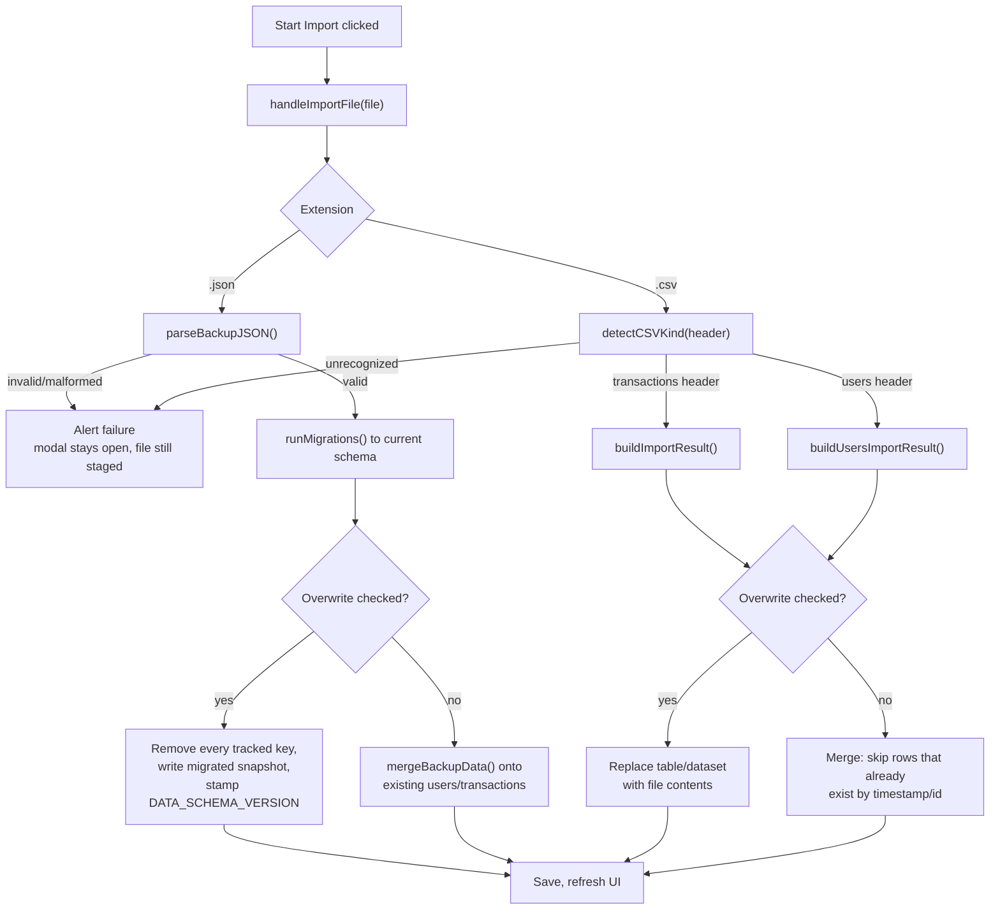

# T4G-0020. Backup & Restore

**Tags:** #csv #storage #users #transactions #ui #migration

## User Story

As a small business owner, I want to export my data as CSV or a full backup and
restore it later, so that I can move it between devices or recover from mistakes.

## Behavior

An Export modal offers transactions CSV, users CSV, or a full JSON backup
(scope depends on the data schema version — see Full JSON backup below). An
Import modal has a single file picker (auto-detects CSV vs. JSON, and which
CSV kind), an "Overwrite data" toggle that switches import from merge to
wholesale replace, and a "Start Import" button — choosing a file only
stages it, so import doesn't start until confirmed. `T4G-0010`/`T4G-0011`
(the earlier transaction-only CSV export/import) are retired; this doc
covers their current behavior too.

## Implementation

### Schema-of-data tagging

Every export (CSV or JSON) is tagged with the schema version of the *data
being exported*, not the running code's `DATA_SCHEMA_VERSION`. `script.js`
computes this once per export via `currentDataSchemaVersion()` — reads
`t4g_dataSchemaVersion` from storage, falling back to `1` when the key is
absent but transactions exist (same baseline as
[T4G-0019](T4G-0019-data-schema-version.md)'s `checkForSchemaMigration`),
else the code's current version — and passes it into the pure builders below
as an explicit parameter. This prevents a backup taken before a pending
migration from being mislabeled as already-migrated data.

### Transactions CSV (export/import)

`src/csv.js`:
- `buildExportCSVContent(transactions, calculateYTDFn, getUserByIdFn, dataSchemaVersion, instanceUrl)` —
  header `Date,User ID,User Name,Taxpayer ID,Currency Code,Currency Name,Amount,Exchange Rate,Quantity,Converted GEL,YTD Income,Comment,Timestamp`,
  one row per transaction, quoting/escaping user name, currency name, and
  comment. YTD is recomputed per row via `calculateYTDFn` rather than reused
  from a batch cache, since export operates on a filtered subset. Ends with
  trailing `#`-prefixed comment lines (file description, GitHub URL,
  instance URL if provided, data schema version) built by a shared
  `buildCommentTail(dataSchemaVersion, instanceUrl)` helper, also used by
  the users CSV export below.
- `buildExportFilename(filterState, getUserByIdFn, todayISODate)` —
  `gel-transactions-all-<date>.csv`, or
  `gel-transactions-<sanitized-user-name>-<date>.csv` when a user filter is
  active.
- `buildImportResult(content, existingTransactions, existingUsers, overwrite = false)` —
  validates the header (`validateCSVHeader`, requires `Date`,
  `Currency Code`, `Converted GEL`), parses each line
  (`parseCSVLine`)/row (`validateCSVRow`), auto-creates any user referenced
  by ID that doesn't already exist (`ensureUserExistsFromCSV`). Comment
  tail lines are silently dropped like any malformed row (none has 12+
  comma-separated values). `overwrite: false` (default) merges into
  `existingTransactions`/`existingUsers` and skips rows whose `Timestamp`
  matches an existing transaction or an earlier row in the same file.
  `overwrite: true` ignores `existingTransactions`/`existingUsers` entirely
  — the result is built purely from the file (plus any users it
  references).

### Users CSV (export/import)

`src/csv.js`:
- `buildUsersCSVContent(users, dataSchemaVersion, instanceUrl)` — header
  `User ID,User Name,Taxpayer ID`, one escaped row per user, same trailing
  comment tail as the transaction export (via `buildCommentTail`). A
  3-column users row can't satisfy `validateCSVRow`'s 12-column minimum, so
  a users export is inert if mistakenly fed to the transactions importer,
  and vice versa.
- `buildUsersImportResult(content, existingUsers, overwrite = false)` —
  validates the header (`validateUsersCSVHeader` in `src/utils.js`, requires
  `User ID`, `User Name`, `Taxpayer ID`), parses each row
  (`parseCSVLine`), builds a candidate `{id, name, taxpayerId}` (name/
  taxpayerId sanitized) and keeps it if `validateUser` accepts it.
  `overwrite: false` (default) starts from `existingUsers`, skips a row
  whose `id` already exists. `overwrite: true` starts empty, so the result
  is exactly the users in the file. Returns
  `{ users, stats: { imported, skipped } }`.
- `detectCSVKind(header)` — returns `'transactions'` if the header has
  `Date`, `Currency Code`, and `Converted GEL`; `'users'` if it has
  `User ID`, `User Name`, and `Taxpayer ID`; `null` otherwise. Used by the
  Import modal to route a `.csv` file to the right importer without asking
  the user to pick a type.

### Full JSON backup

The backup's contents depend on the schema version of the data being
exported (`currentDataSchemaVersion()`, same value used for the
schema-of-data tag above) — **not a snapshot of every `localStorage` key
unconditionally**:

| Schema version | Scope | Includes | Excludes |
| --- | --- | --- | --- |
| `1` (legacy) | legacy scope | `users`, `transactions`, every `t4g_`-prefixed key (at schema `1`, just `t4g_appVersion`/`t4g_dataSchemaVersion`) | rate cache (`currencyRates_<date>`), UI settings (`themePreference`, `addTransaction`) — genuine schema-`1` data predates the `t4g_` namespace entirely, so they're still under their unprefixed names and don't match either branch of the filter |
| `2`+ (current, since [T4G-0021](T4G-0021-schema-migration-key-namespacing.md)) | `t4g_`-only scope | every `t4g_`-prefixed key — now legitimately includes the actual data tables (`t4g_data_users`, `t4g_data_transactions` — see `src/keys.js`), UI settings (`t4g_config_*`), and the rate cache (`t4g_cache_*`) | nothing relevant — a genuinely complete snapshot |

Restoring a backup migrates its data to the current schema before applying
it (`processJSONImport()`, `script.js`, via `runMigrations()` —
[T4G-0021](T4G-0021-schema-migration-key-namespacing.md)), so a schema-`1`
backup's raw `users`/`transactions`/`themePreference` keys land under their
`t4g_`-prefixed equivalents on restore, whichever scope the original export
was taken under.

`src/backup.js`:
- `selectBackupKeys(allKeys, dataSchemaVersion)` — pure filter implementing
  the two scopes above, given every currently-stored key
  (`getAllStorageKeys()`, `src/storage.js`) and the schema version.
- `buildBackupJSON(storageSnapshot, dataSchemaVersion, instanceUrl)` — takes
  a plain `{ key: value }` object (already-parsed values for the keys
  `selectBackupKeys` selected) and wraps it in an envelope:
  `{ app, dataSchemaVersion, exportedAt, instanceUrl?, data }`.
  `exportedAt` is an ISO timestamp. Reuses the `APP_NAME`/`GITHUB_URL`
  constants exported from `src/csv.js`.
- `parseBackupJSON(jsonString)` — parses the string and checks it has a
  `data` object; throws `ERROR_MESSAGES.INVALID_BACKUP` if the JSON is
  malformed or isn't a backup envelope. Returns `{ data, meta }` where
  `meta` is every envelope field except `data`.
- `mergeBackupData(existingUsers, existingTransactions, backupData)` — for
  a non-overwrite JSON restore: adds each user in
  `backupData[STORAGE_KEYS.users]` that passes `validateUser` and isn't
  already present by `id`; adds each transaction in
  `backupData[STORAGE_KEYS.transactions]` that passes `validateTransaction`
  and isn't already present by `timestamp`. Returns `{ users, transactions }`.
  `backupData` is expected already migrated to the current schema, so it's
  read from the canonical keys (`src/keys.js`), not raw
  `users`/`transactions`. Settings keys (theme, versions, rate cache) are
  left untouched on a non-overwrite restore — only users/transactions are
  merged.

`script.js`:
- `exportBackupJSON()` — computes `currentDataSchemaVersion()`, filters
  `getAllStorageKeys()` through `selectBackupKeys`, snapshots only the
  selected keys via `getFromStorage`, builds the JSON with
  `window.location.href`, downloads `gel-backup-<date>.json`. Reads
  storage directly (not through `filterState`), so — unlike `exportToCSV`
  — it's inherently unfiltered within whatever scope applies.
- On import, a `.json` file is restored via `parseBackupJSON`, then
  migrated to the current schema via
  `runMigrations(data, meta.dataSchemaVersion, DATA_SCHEMA_VERSION)`
  ([T4G-0021](T4G-0021-schema-migration-key-namespacing.md)) before being
  applied. `overwrite: false` calls `mergeBackupData` on the migrated
  snapshot and saves the merged `users`/`transactions` only; `overwrite:
  true` removes every currently-tracked key (`getAllStorageKeys` +
  `removeFromStorage`) then writes every key from the migrated snapshot
  as-is and stamps `DATA_SCHEMA_VERSION`.

### Modals

`index.html`: `#exportModal` and `#importModal`, styled like
[T4G-0019](T4G-0019-data-schema-version.md)'s `.modal-overlay`/`.modal`
(a higher `z-index` than the update/migration modals so they can layer on
top when opened from the migration flow).

- **Export modal**: three buttons — Transactions (CSV), Users (CSV), Full
  backup (JSON) — each calling its respective `script.js` function
  directly. The JSON option is styled as the primary action; only it sets
  `migrationBackupDownloaded = true` (see Quirks & Decisions).
- **Import modal**: a "Choose file…" button triggering a hidden
  `<input type="file" accept=".csv,.json">`, an "Overwrite data" checkbox
  (default unchecked), a warning paragraph — shown only while the checkbox
  is checked — recommending a full backup first, and a "Start Import"
  button. Choosing a file only *stages* it: `onImportFileChosen()` shows
  the picked filename and enables "Start Import" (disabled until then).
  `openImportModal()` resets the checkbox, warning, staged filename, and
  disables "Start Import" again each time the modal opens.

The toolbar's "⬇ Export" (`openExportModal()`) / "⬆ Import"
(`openImportModal()`) buttons open these modals. The transaction-only
`exportToCSV()`/`importFromCSV()`/`processCSVContent()` functions are used
directly by the modals' "Transactions (CSV)" option and by "Load Demo Data"
([T4G-0012](T4G-0012-demo-data.md), which always merges).

**Migration modal reuse**: [T4G-0019](T4G-0019-data-schema-version.md)'s
migration modal's "Download backup" button calls `openExportModal()`
instead of downloading a CSV directly, so a schema migration can produce a
complete JSON restore point (or either of the other two formats).

## Quirks & Decisions

- Quirk: `migrationBackupDownloaded` (shared with
  [T4G-0019](T4G-0019-data-schema-version.md)) is set only by a successful
  `exportBackupJSON()` call, never by the transactions-CSV or users-CSV
  export — a filtered transactions CSV or a users CSV with no transactions
  isn't guaranteed to be a *complete* backup the way the JSON snapshot is.
  Proposed: keep as-is; this is intentional, not an oversight.
- Quirk: the Export and Import modals only close via their own "Close"/
  "Start Import" buttons — no backdrop click or Escape key. Unlike the
  update/migration modals ([T4G-0018](T4G-0018-update-notification.md),
  [T4G-0019](T4G-0019-data-schema-version.md)), nothing here requires
  forced acknowledgment, so this is just a missing convenience, not a
  deliberate choice.
  Proposed: close on backdrop click, `Escape`, and the Android back
  gesture (`popstate`), same as [T4G-0014](T4G-0014-data-and-cache-clearing.md)'s
  Clear Data modal — share one dismissal helper across all three.

## Testing

### Human

- Click "⬆ Export" — modal shows three export options; each downloads the
  expected file type with the correct extension and content.
- Click "⬆ Import", pick a file — "Start Import" is disabled until a file
  is chosen, then shows the picked filename and enables; nothing imports
  yet. Click "Start Import" with a transactions CSV, "Overwrite data"
  unchecked — merges in, reports imported/skipped/created counts.
- Pick a users CSV, click "Start Import" — new users are added by ID; an
  ID that already exists is skipped, not overwritten.
- Check "Overwrite data" — a warning appears recommending a backup first;
  importing a transactions or users CSV now replaces the whole
  table/dataset with the file's contents instead of merging.
- On a normal install (today's real schema version, `2`+ — see
  [T4G-0021](T4G-0021-schema-migration-key-namespacing.md)), export a full
  JSON backup, clear all data, re-import it with "Overwrite data" checked
  — `users`, `transactions`, theme, and the add-transaction checkbox are
  all restored exactly, since every key is now `t4g_`-prefixed.
- Import that same JSON backup again without "Overwrite data" — users and
  transactions merge in without duplicating.
- In devtools, seed legacy (unprefixed) `users`/`transactions` keys and set
  `t4g_dataSchemaVersion` to `1`, then export a full JSON backup — the file
  contains `users`/`transactions`/`t4g_appVersion`/`t4g_dataSchemaVersion`,
  but not `themePreference` or any `currencyRates_*` key.
- Trigger the migration modal (schema `1` data, code at schema `2`), click
  "Download backup" — the shared Export modal opens; downloading the full
  JSON backup lets "Continue" proceed without the no-backup confirmation.

### Unit

`tests/unit/csv.test.js`/`csv-workflow.test.js`: `detectCSVKind` for both
header kinds and an unrecognized header; `buildUsersCSVContent` escaping
and comment tail; `buildUsersImportResult` merge vs. overwrite, dedup by
id, invalid rows dropped; `buildImportResult` overwrite vs. default merge;
`buildExportCSVContent` writes the injected `dataSchemaVersion`, not the
code constant.

`tests/unit/backup.test.js`: `buildBackupJSON` envelope shape; round-trip
through `parseBackupJSON`; throws on malformed/non-backup JSON;
`mergeBackupData` adds only new users/transactions by id/timestamp, reading
them from the canonical `STORAGE_KEYS` (`src/keys.js`); `selectBackupKeys` —
schema `1` keeps `users`/`transactions`/`t4g_*` and drops settings/rate-cache
keys, schema `0`/`2`/other keep only `t4g_*`, empty key lists and lists with
no `t4g_*` keys behave sanely.

`tests/unit/storage.test.js`: `getAllStorageKeys` reflects every key
written via `saveToStorage`.

### Integration

`tests/integration/app.test.js`: Export modal buttons produce the right
file per option; a full JSON backup at (seeded, legacy) schema `1` includes
`users`/`transactions`/`t4g_*` but not settings/rate-cache (and ignores
active filters), while a backup at the current schema version includes
every `t4g_*` key, now including the migrated data tables; restoring an old
schema-`1` JSON backup migrates it to the current key names before applying
it; choosing a file stages it (`onImportFileChosen()` enables
"Start Import" without importing) and only `startImport()` actually runs
it; Import modal auto-detects `.json` vs. each `.csv` kind; overwrite
checked replaces existing data, unchecked merges; migration modal's
"Download backup" opens the Export modal and marks
`migrationBackupDownloaded` on a successful JSON export from it.

## Status

Implemented
